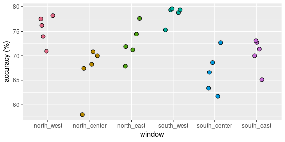
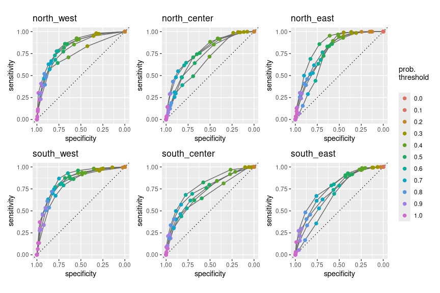
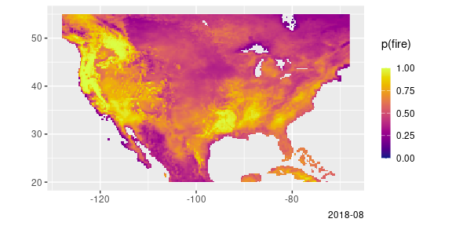
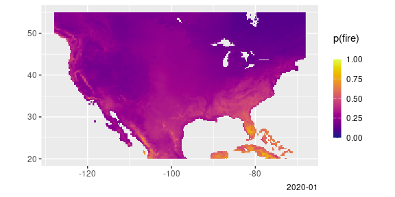

# VPD-based Fire Risk Model

Carlos Dobler  
Research Scientist  
Woodwell Climate Research Center  
September, 2024

This report shows results of a model trained to predict fire occurrence
as a function of monthly vapor pressure deficit (VPD; from ERA5) and
aboveground biomass (from ORNL). The model consists of a logistic
regression with both predictors set up as interacting terms. It was
trained on six partially overlapping spatial windows that together cover
the whole CONUS. The rationale for training the model on a per-window
basis was so that it could capture different fire regimes across the
country. Once trained, predictions from different windows are stitched
together applying a weighted average on overlapping areas, with weights
being based on the distance to the center of windows.

Fire occurrence was obtained from MODIS’s MOD14A2 product. Only data
with the highest quality assessment rating was used. Quasi-absence data
was generated by randomly sampling unburned grid cells at random dates.

The model was trained with fire occurrence and VPD data from 2000 to
2020. Biomass was incorporated into the model as a static variable,
which means results assume it does not change over time.

To test its accuracy, I conducted a five-fold spatial cross-validation
for each window. Folds here represent non-overlapping areas within the
window, which ensures spatial autocorrelation is controlled for in the
validation process.

The figure below shows the accuracy of model predictions for each fold
for each of the six windows:

Overall accuracy (across folds and windows): 71.7%.

.

The following figure shows receiver operating characteristic (ROC)
curves for each fold and each window:

Overall AUC (area under the curve): 0.78.

.

The figure below shows the accuracy of the model per land cover class
for each window:

.

As an example of results, the map below shows the probability of fire
occurrence (p(fire)) for a random month in the summer season (JJA):

Below are the number of fire events registered by the MOD14A2 product
for the same month:

Same as above, but for the winter season (DJF):

…and MOD14A2 for the same month:

The map below shows the probability of p(fire) \> 0.9 on the 20 years
used for training:

